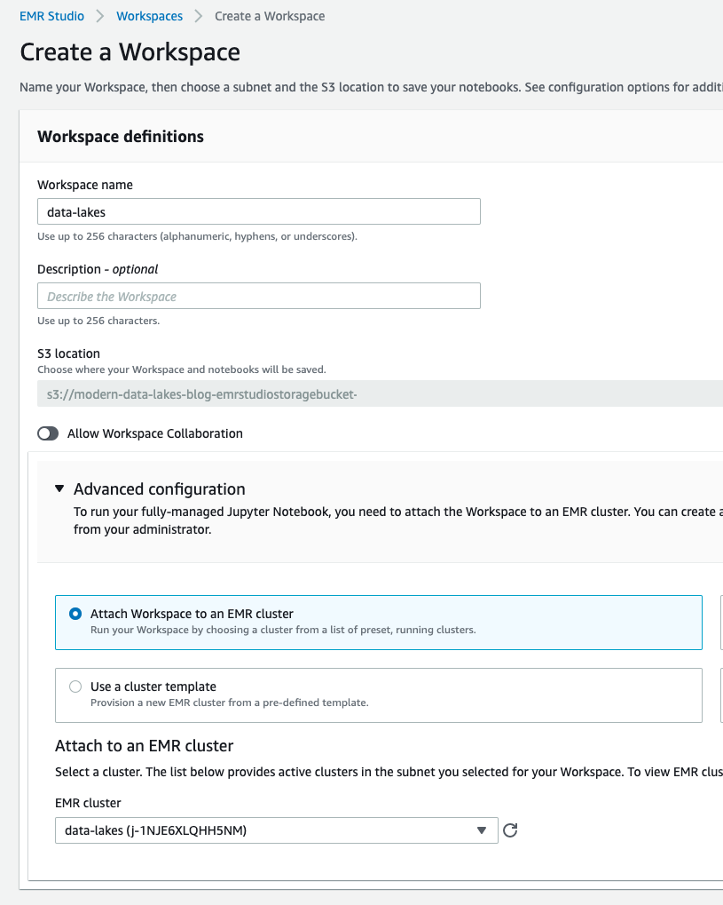

# Modern Data Lake Storage Layers

This repository contains supporting assets for my research in modern Data Lake storage layers like Apache Hudi, Apache Iceberg, and Delta Lake.

Specifically, there's a [CloudFormation template](cloudformation/emr-studio-cluster.cfn.yaml) to create an EMR cluster and EMR Studio with the necessary requirements and Jupyter notebooks with the example walkthroughs.

You can view the corresponding [blog post](https://dacort.dev/posts/modern-data-lake-storage-layers/) and [video](https://www.youtube.com/watch?v=fryfx0Zg7KA)

## Pre-requisites

You'll need an AWS Account in which you have administrator privileges and the ability to deploy a CloudFormation template. The template **will** create an EMR Cluster and S3 bucket that will incur charges - be sure to either shut down the cluster when done or delete the CloudFormation stack. In order to delete the CloudFormation stack, you'll need to:

- Manually delete any EMR Studio Workspaces you created
- Manually empty the S3 bucket created by CloudFormation
- Manually delete the VPC created by CloudFormation due to auto-created rules

## Overview

The included CloudFormation template creates a new VPC and EMR Cluster for you to be able to run the notebooks. An EMR Studio is also created and you can find the Studio URL in the `Outputs` tab of your CloudFormation Stack.

Once the stack is done creating, you'll need to navigate to EMR Studio and create a new workspace attached to the "data-lakes" cluster.

Inside the workspace you either upload each notebook individually from the [notebooks/](notebooks/) folder or simply connect to this repository by using the "Git" icon on the left-hand side.
